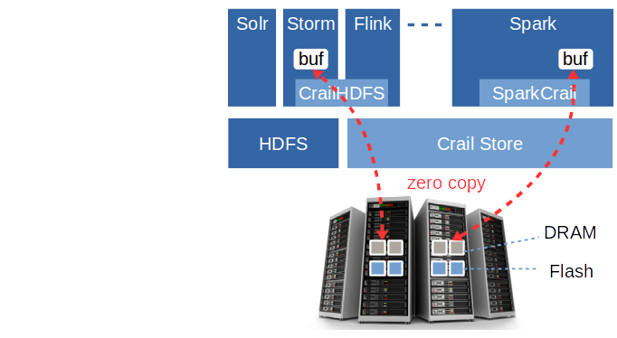
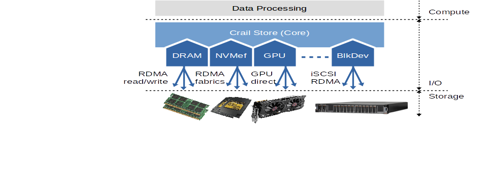
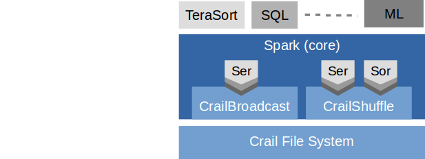

 

Modern storage and network technologies such as 100Gb/s Ethernet, RDMA, NVMe flash, etc., present new opportunities for data processing systems to further reduce the response times of analytics queries on large data sets. Unfortunately, leveraging modern hardware in systems like Spark, Flink or Hadoop remains challenging, for multiple reasons:

* Performance: today's data processing stacks employ many software layers, which is key to making the stacks modular and flexible to use. But the software layers also impose overheads during I/O operations that prevent applications from enjoying the full potential of the high-performance hardware. To eliminate these overheads, I/O operations must interact with the hardware directly from within the application context using principles like RDMA, DPDK or SPDK.

* New opportunities: the improved performance of modern networking and storage hardware opens the door to rethinking the interplay of I/O and compute in a distributed data processing system. For instance, low latency remote data access enables schedulers to relax on data locality and in turn make better use of compute resources. At one extreme, storage resources can be completely disaggregated which is more cost effective and simplifies maintenance.

* Heterogeneity: with modern hardware, I/O operations are becoming more complex. Not only are there more options to store data (disk, flash, DRAM, disaggregated storage, etc.) but also it is getting increasingly important to use storage resources efficiently. For  instance, some newer technologies such as phase change memory (PCM) permit data access at byte granularity. Mediating storage access through a block device interface is a bad fit in such a case. Moreover, with accelerators like GPUs or FPGAs extending the traditional compute layer, new distributed interfaces to accelerator-local memories are needed.

In the [Blog](http://crail.io/blog) section we discuss each of those challenges in more detail.

## Crail Architecture

 

Crail aims at providing a comprehensive solution to the above challenges in a form that is non-intrusive and compatible with the Apache data processing ecosystem. In particular, Crail is designed to be consumeable by different compute engines such as Spark, Flink, Solr, etc., with very little integration effort. 

<h3 id="overview">Overview</h3>

The backbone of the Crail I/O architecture is Crail Store, a high-performance multi-tiered data store for temporary data in analytics workloads. If the context permits we often refer to Crail Store simply as Crail. Data processing frameworks and applications may directly interact with Crail for fast storage of in-flight data, but more commonly the interaction takes place through one of the Crail modules. As an example, the CrailHDFS adapter provides a standard HDFS interface allowing applications to use Crail Store the same way they use regular HDFS. Applications may want to use CrailHDFS for short-lived performance critical data, and regular HDFS for long-term data storage. CrailSparkIO is a Spark specific module which implements various I/O intensive Spark operations such as shuffle, broadcast, etc. Both CrailHDFS and CrailSparkIO can be used transparently with no need to recompile either the application or the data processing framework. 

 

  

Crail modules are thin layers on top of Crail Store. Implementing new modules for a particular data processing framework or a specific I/O operation requires only a moderate amount of work. At the same time, modules inherit the full benefits of Crail in terms of user-level I/O, performance and storage tiering. For instance, in the blog section we show that the Crail-based shuffle engine for Spark permits all-to-all data shuffling very close to the speed of the 100Gb/s network fabric. 

<h3 id="fs">Crail Store</h3>

Crail Store implements a hierarchical namespace across a cluster of RDMA interconnected storage resources such as DRAM or flash. Storage resources may be co-located with the compute nodes of the cluster, or disagreggated inside the data center, or a mix of both. Nodes in the Crail namespace consist of arrays of blocks distributed across storage resources in the cluster. Crail groups storage resources into different tiers (e.g, DRAM, flash, disk) and permits node segments (blocks) to be allocated in specific tiers but also across tiers. For instance, by default Crail uses horizontal tiering where higher performing storage resources are filled up across the cluster prior to using lower performing tiers -- resulting in a more effective usage of storage hardware. 

Crail currently supports three types of nodes to be stored in its namespace: regular data files, directories and multifiles. Regular data files are append-and-overwrite with only a single-writer permitted per file at a given time. Append-andoverwrite means that – aside from appending data to the file – overwriting existing content of a file is also
permitted. Directories in Crail are just regular files containing fixed length directory records. The advantage
is that directory enumeration becomes just a standard file read operation which makes enumeration fast and
scalable with regard to the number of directory entries. Multifiles are files that can be written concurrently.
Internally, a multifile very much resembles a flat directory. Multiple concurrent substreams on a multifile are
backed with separate files inside the directory. 

 

Access to storage resources over the network -- as happening during file read/write operations -- are implemented using RDMA. For instance, accesses to blocks residing in the DRAM tier are implemented using one-sided read/write RDMA operations. With one-sided operations the storage nodes remain completely passive and, thus, are not wasting any CPU cycles for I/O. At the same time, the client benefits from zero-copy data placements, freeing CPU cycles that would otherwise be used for memory copying, context switching, etc. One-sided operations are also very effective for reading or writing subranges of storage blocks as only the relevant data is shipped over the network, as opposed to shipping the entire block. 

In Crail, storage tiers are actual plugins. A storage tier defines the type of storage protocol and network hardware it supports. For instance, the disaggregated flash tier supports shared flash storage accessed through SRP (SCSI RDMA protocol), versus, the upcoming NVMef storage will be supporting NVMe flash access over RDMA fabrics. 

 

  

Files in Crail are append-and-overwrite with a single-writer per file at a given time and file write ownership is granted in the form of leases. Generally, all the read/write operations are asynchronous, which facilitates interleaving of computation and I/O during data processing. Aside from the standard file system operations, Crail provides extra semantics geared towards its use case. For instance, Crail exports functions to allocate dedicated I/O buffers from a reuseable pool -- memory that is registered with the hardware if needed to support zero-copy I/O. Moreover, Crail provides detailed control as to which storage tier and location preference should be used when allocating file system resources. 

Crail not only exports a Java API but also is written entirely in Java, which makes it easy to use and allows for a better integration with data processing frameworks like Spark, Flink, Hadoop, etc. A simple example of a Crail write operation is shown below:

    CrailConfiguration conf = new CrailConfiguration();
    CrailFS fs = CrailFS.newInstance(conf);
    CrailFile file = fs.createFile(filename, 0, 0).get().syncDir();
    CrailOutputStream outstream = file.getDirectOutputStream();
    ByteBuffer dataBuf = fs.allocateBuffer();
    Future<DataResult> future = outputStream.write(dataBuf);
    ...
    future.get();

Crail uses <a href="https://github.com/zrlio/disni">DiSNI</a>, a user-level network and storage stack for the Java virtual machine. DiSNI allows data to be exchanged in a zero-copy fashion between Java I/O memory and remote storage resources over RDMA. 

<h3>Crail HDFS Adapter</h3>

The Crail HDFS adaptor enables users to access Crail using the standard HDFS API. For instance, administrators can interact with Crail using the standard HDFS shell:

    ./bin/crail fs -mkdir /test
    ./bin/crail fs -ls /
    ./bin/crail fs -copyFromLocal <path-to-local-file> 
    ./bin/crail fs -cat /test/<file-name>

Moreover, regular HDFS-based applications will transparently work with Crail when using fully qualified path names (or when specifying Crail as the default Hadoop file system):

    Configuration conf = new Configuration();
    FileSystem fs = FileSystem.get(conf);
    fs.create("crail://test/hello.txt");
    
 <h3 id="spark">Crail Spark Module</h3>   

The Crail Spark module includes a Crail based shuffle engine as well as a broadcast service. The shuffle engine maps key ranges to directories in Crail. Each map task, while partitioning the data, appends key/value pairs to individual files in the corresponding directories. Tasks running on the same core within the cluster append to the same files, which reduces storage fragmentation. 

 

  

As is the case with the Crail HDFS adapter, the shuffle engine benefits from the performance and tiering advantages of the Crail data store. For instance, individual shuffle files are served using horizontal tiering. In most cases that means the files are filling up the memory tier as long as there is some DRAM available in the cluster, after which they extend to the flash tier. The shuffle engine further uses the Crail location affinity API to make sure local DRAM and flash is preferred over remote DRAM and flash respectively. Note that the shuffle engine is also completely zero-copy, as it transfers data directly from the I/O memory of the mappers to the I/O memory of the reducers. 

The Crail-based broadcast plugin for Spark stores broadcast variables in Crail files. In contrast to the shuffle engine, broadcast is implemented without location affinity, which makes sure the underlying blocks of the Crail files are distributed across the cluster, leading to a better load balancing when reading broadcast variables. Crail shuffle and broadcast components can be enabled in Spark by setting the following system properties in spark-defaults.conf:

    spark.shuffle.manager		org.apache.spark.shuffle.crail.CrailShuffleManager
    spark.broadcast.factory		org.apache.spark.broadcast.CrailBroadcastFactory

Both broadcast and shuffle require Spark data objects to be serialized into byte streams (as is also the case for the default Spark broadcast and shuffle components). Even though both Crail components work fine with any of the Spark built-in serializers (e.g. Kryo), to achieve the best possible performance applications running on Crail are encouraged to provide serialization and deserialization methods for their data types explicitly. One reason for this is that the built-in Spark serializers assume byte streams of type java.io.(InputStream/OutputStream). These stream types are less powerful than Crail streams. For instance, streams of type InputStream/OutputStream expose a synchronous API and are restricted to on-heap memory. Crail streams, on the other hand, expose an asynchronous API and integrate well with off-heap memory to reduce data copies. By defining custom serialization/deserialization methods, applications can take full advantage of Crail streams during broadcast and shuffle operations. Moreover, serializers dedicated to one particular application type may further exploit information about the specific application data types to achieve a better performance. As we show in the blog, a custom serializer for a sorting application running on key/value objects of a fixed length byte array will not need to store serialization meta data, which reduces the final data size and simplifies the serialization process. 

 

  

Serialization is one important aspect for broadcast and shuffle operations, sorting another, even though specific to shuffling. Sorting directly follows the network fetch phase in a shuffle operation if a key ordering is requested by the application. Again, the Crail shuffle engine works fine with the Spark built-in sorter, but often the shuffle performance can be improved by an application specific sorter. For instance, an application may use the Crail GPU tier to store data. In that case, sorting can be pushed to the GPU, rather than fetching the data into main memory and sorting it on the CPU. In other cases, the application may know the data types in advance and use the information to simplify sorting (e.g. use Radix sort instead TimSort).

Application specific serializers and sorters can be defined by setting the following system properties in spark-defaults.conf:

    spark.crail.shuffle.serializer  
    spark.crail.shuffle.sorter	
    

